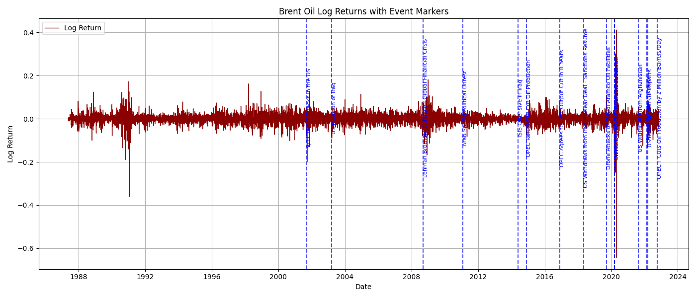

# Week 10 Interim Report

## KAIM Challenge — Brent Oil Price Change Analysis

Mesfin Mulugeta | 10 Academy | August 2025

---

## 1. Data Analysis Workflow

**Objective**: To analyze how major geopolitical and economic events have historically influenced Brent crude oil prices, and to detect statistically significant structural changes in pricing behavior.

**Workflow Steps**:

1. **Data Collection**: Load historical Brent oil prices (1987–2022) and compile a timeline of impactful real-world events.
2. **Data Preprocessing**: Clean and parse date columns, compute log returns for stationarity.
3. **EDA**: Visualize price and volatility trends. Overlay key events for contextual correlation.
4. **Modeling**: Use Bayesian Change Point Detection (PyMC3) to identify shifts in the distribution.
5. **Event Matching**: Associate detected change points with global events.
6. **Insight Reporting**: Build a dashboard for investors and policymakers to explore results.

---

## 2. Key Events Dataset

A curated list of 15 significant geopolitical and economic events is compiled in `data/key_events.csv`. These include:

- 2008 Global Financial Crisis
- 2014 OPEC market shock
- 2020 COVID-19 pandemic
- 2022 Russia-Ukraine War
  … and more.

Each row includes:

- `date` — approximate start of event
- `event` — description

---

## 3. Assumptions & Limitations

- **Assumption**: Log returns are normally distributed within segments.
- **Assumption**: Single change point model for first version.
- **Limitation**: External events are assumed independent; some may overlap in impact.
- **Limitation**: Modeling detects correlation, not strict causality.
- **Challenge**: Oil prices are influenced by a mix of observed and latent factors (demand, speculation, supply shocks).

---

## 4. Communication Plan

- **Investors**: Visual insights, price shifts, volatility regions (via React Dashboard)
- **Policymakers**: PDF reports with time-stamped analysis of price impacts from global events
- **Analysts**: Technical metrics (posterior distributions, model fit, uncertainty)

---

## 5. Understanding the Data & Model

### 📈 Data Properties

- Daily price records from `1987-05-20` to `2022-09-30`
- Format: `Date (str), Price (float)`
- Converted to datetime and log returns for modeling

### 🔹 Why Change Point Modeling?

Change point models help detect **structural breaks** — sudden changes in the mean or variance of a time series. These breakpoints often coincide with real-world events like economic crises or political instability. They allow us to:

- Quantify **how behavior changes** (e.g., mean or volatility shift)
- Estimate **when** the market regime changed
- Build **narratives** supported by data

### 🧪 Expected Outputs

- `tau`: the change point date
- `mu_1` and `mu_2`: mean before/after the change
- `sd_1` and `sd_2` (optional): volatility before/after
- Posterior distributions for all parameters
- Visual confidence about when change likely occurred

---

## 📎 Files & Artifacts

- `data/key_events.csv`: List of real-world impactful events
- `data/brent_prices.csv`: Daily Brent oil prices (1987–2022)
- `frontend/`: React dashboard (in progress)
- `backend/`: Flask API and PyMC3 model (in progress)
- `reports/`: This interim report

---

### 📊 Summary Statistics of Log Returns

| Metric  | Value     |
| ------- | --------- |
| Count   | 9010      |
| Mean    | 0.000179  |
| Std Dev | 0.025532  |
| Min     | -0.643699 |
| 25%     | -0.011154 |
| Median  | 0.000402  |
| 75%     | 0.012127  |
| Max     | 0.412023  |

These results confirm that while Brent oil prices exhibit an upward drift, the log returns show strong volatility and are nearly symmetric, with extreme outliers on both ends.

### 📉 Log Return Volatility and Event Overlays

The plot below shows daily log returns of Brent oil prices from 1987 to 2022, with vertical markers representing 15 major geopolitical and economic events.

Notable spikes in volatility align closely with:

- **2008**: Global financial crisis
- **2020**: COVID-19 pandemic and oil price war
- **2022**: Russian invasion of Ukraine

## ✅ Next Steps

- Implement the PyMC3 Bayesian change point model
- Deploy interactive dashboard to visualize insights
